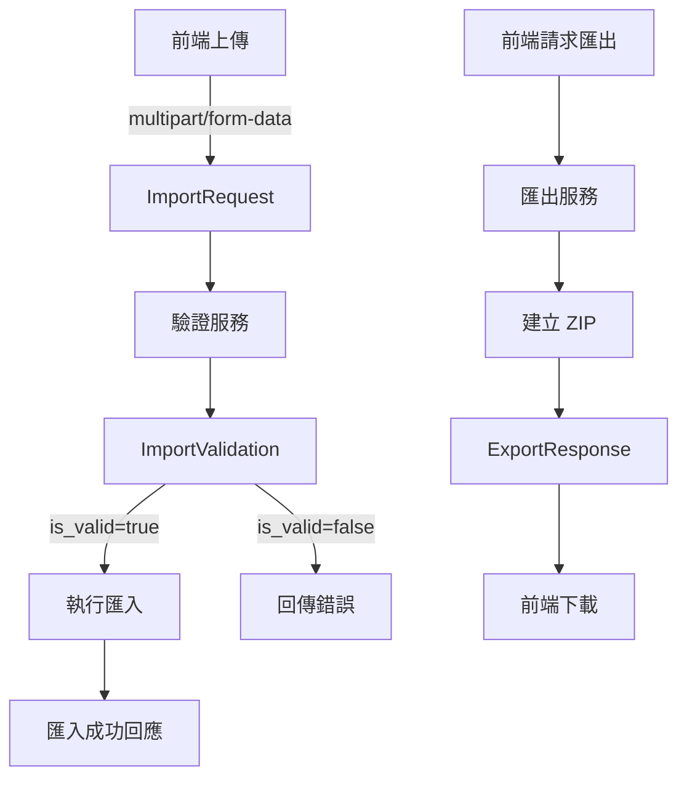
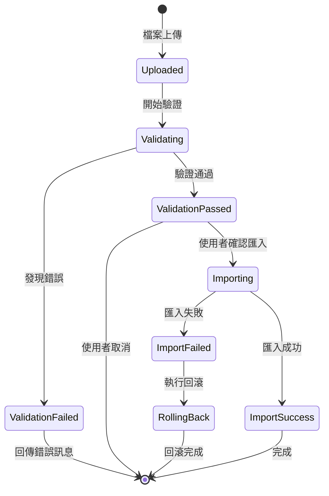

# Data Model: 資料匯出匯入功能

**Feature**: 001-data-export-import  
**Created**: 2025-10-25  
**Purpose**: 定義匯出/匯入功能所需的資料模型和驗證規則

## Overview

本功能涉及三個主要資料模型:
1. **ExportResponse**: 匯出操作的回應資料
2. **ImportValidation**: 匯入檔案的驗證結果
3. **ImportRequest**: 匯入操作的請求資料

所有模型使用 Pydantic BaseModel 定義,提供自動驗證和序列化。

## Core Entities

### 1. ExportResponse

匯出操作成功時回傳的資料模型。

**用途**: 提供下載連結和檔案資訊給前端。

**欄位**:

| 欄位名稱 | 類型 | 必填 | 說明 | 驗證規則 |
|---------|------|------|------|----------|
| `filename` | `str` | ✓ | ZIP 檔案名稱 | 格式: `export_data_{YYYYMMDD_HHMMSS}.zip` |
| `file_size` | `int` | ✓ | 檔案大小(bytes) | `>= 0` |
| `created_at` | `str` | ✓ | 建立時間 (ISO 8601) | ISO 8601 格式 |
| `file_count` | `int` | ✓ | 包含的檔案總數 | `>= 0` |
| `download_url` | `str` | ✓ | 下載端點路徑 | 相對路徑: `/api/export/download/{filename}` |

**範例**:

```json
{
  "filename": "export_data_20251025_143052.zip",
  "file_size": 2048576,
  "created_at": "2025-10-25T14:30:52+08:00",
  "file_count": 245,
  "download_url": "/api/export/download/export_data_20251025_143052.zip"
}
```

**狀態**: 無狀態,純資料傳輸物件 (DTO)

---

### 2. ImportValidation

匯入檔案驗證的結果資料模型。

**用途**: 回報驗證狀態和任何發現的問題。

**欄位**:

| 欄位名稱 | 類型 | 必填 | 說明 | 驗證規則 |
|---------|------|------|------|----------|
| `is_valid` | `bool` | ✓ | 整體驗證是否通過 | `true` 或 `false` |
| `errors` | `List[ValidationError]` | ✓ | 驗證錯誤列表 | 若 `is_valid=false` 則必須包含至少一個錯誤 |
| `warnings` | `List[str]` | ✗ | 警告訊息列表 | 選填,用於非阻斷性提示 |
| `file_count` | `int` | ✓ | ZIP 中找到的檔案總數 | `>= 0` |
| `validated_at` | `str` | ✓ | 驗證時間 (ISO 8601) | ISO 8601 格式 |

**子模型: ValidationError**

| 欄位名稱 | 類型 | 必填 | 說明 |
|---------|------|------|------|
| `error_type` | `str` | ✓ | 錯誤類型: `structure`, `filename`, `date`, `weekday`, `size` |
| `file_path` | `str` | ✓ | 問題檔案的相對路徑 |
| `message` | `str` | ✓ | 友善的錯誤訊息 (繁體中文) |
| `details` | `str` | ✗ | 技術細節 (選填) |

**範例 (驗證失敗)**:

```json
{
  "is_valid": false,
  "errors": [
    {
      "error_type": "filename",
      "file_path": "Day/2025130.md",
      "message": "檔案名稱格式錯誤: 應為 YYYYMMDD.md 格式",
      "details": "Expected 8 digits, got 7"
    },
    {
      "error_type": "weekday",
      "file_path": "Week/20251020.md",
      "message": "周計畫檔名日期不是星期日 (2025-10-20 是星期一)",
      "details": "weekday=0, expected=6"
    }
  ],
  "warnings": [],
  "file_count": 18,
  "validated_at": "2025-10-25T14:35:10+08:00"
}
```

**範例 (驗證通過)**:

```json
{
  "is_valid": true,
  "errors": [],
  "warnings": [
    "建議在匯入前先匯出現有資料作為備份"
  ],
  "file_count": 245,
  "validated_at": "2025-10-25T14:36:22+08:00"
}
```

**驗證流程**:

1. **結構驗證**: 檢查 ZIP 是否包含 Day, Week, Month, Year 目錄
2. **檔名驗證**: 檢查每個 .md 檔案的檔名格式
3. **日期驗證**: 驗證日期的有效性 (無 2025-13-01)
4. **星期驗證**: Week 目錄中的檔案日期必須是星期日
5. **大小驗證**: 檔案大小不超過 100MB 限制

---

### 3. ImportRequest

匯入操作的請求資料模型。

**用途**: 前端上傳 ZIP 檔案時的請求。

**欄位**:

| 欄位名稱 | 類型 | 必填 | 說明 | 驗證規則 |
|---------|------|------|------|----------|
| `file` | `UploadFile` | ✓ | 上傳的 ZIP 檔案 | Content-Type: `application/zip` 或 `application/x-zip-compressed` |
| `overwrite` | `bool` | ✗ | 是否覆蓋同名檔案 | 預設: `true` |
| `validate_only` | `bool` | ✗ | 僅驗證不匯入 | 預設: `false`,用於預檢 |

**處理流程**:

1. 接收檔案上傳
2. 儲存到臨時目錄
3. 執行驗證
4. 若 `validate_only=false` 且驗證通過,執行匯入
5. 清理臨時檔案
6. 回傳結果

**範例請求** (multipart/form-data):

```http
POST /api/import/upload
Content-Type: multipart/form-data; boundary=----WebKitFormBoundary

------WebKitFormBoundary
Content-Disposition: form-data; name="file"; filename="export_data_20251020_120000.zip"
Content-Type: application/zip

[binary data]
------WebKitFormBoundary
Content-Disposition: form-data; name="overwrite"

true
------WebKitFormBoundary
Content-Disposition: form-data; name="validate_only"

false
------WebKitFormBoundary--
```

---

## Entity Relationships



**關係說明**:
- `ImportRequest` 觸發驗證流程產生 `ImportValidation`
- `ImportValidation.is_valid` 決定是否執行實際匯入
- `ExportResponse` 獨立於匯入流程,僅用於匯出

---

## Validation Rules

### 檔名格式規則

| 目錄 | 格式 | 正則表達式 | 範例 |
|------|------|------------|------|
| Day | `YYYYMMDD.md` | `^\d{8}\.md$` | `20251025.md` |
| Week | `YYYYMMDD.md` (必須是星期日) | `^\d{8}\.md$` + weekday check | `20251019.md` |
| Month | `YYYYMM.md` | `^\d{6}\.md$` | `202510.md` |
| Year | `YYYY.md` | `^\d{4}\.md$` | `2025.md` |

### 日期有效性規則

- 年份範圍: 2000-2099
- 月份範圍: 01-12
- 日期範圍: 依月份和閏年計算 (使用 `datetime` 驗證)
- 星期日判斷: `datetime.weekday() == 6`

### 檔案大小規則

- 單一檔案上限: 5MB
- ZIP 總大小上限: 100MB
- 檔案數量上限: 10,000 個

---

## State Transitions

### 匯入流程狀態



**狀態說明**:
- **Uploaded**: 檔案已上傳到臨時目錄
- **Validating**: 執行格式驗證
- **ValidationFailed**: 發現格式錯誤,阻止匯入
- **ValidationPassed**: 驗證通過,等待使用者確認
- **Importing**: 正在將檔案寫入 backend/data
- **ImportSuccess**: 所有檔案成功寫入
- **ImportFailed**: 寫入過程發生錯誤
- **RollingBack**: 刪除已寫入的檔案,還原原狀

---

## Implementation Notes

### Pydantic 模型定義

```python
from pydantic import BaseModel, Field, validator
from typing import List, Optional
from datetime import datetime
from enum import Enum

class ErrorType(str, Enum):
    STRUCTURE = "structure"
    FILENAME = "filename"
    DATE = "date"
    WEEKDAY = "weekday"
    SIZE = "size"

class ValidationError(BaseModel):
    error_type: ErrorType
    file_path: str
    message: str
    details: Optional[str] = None

class ImportValidation(BaseModel):
    is_valid: bool
    errors: List[ValidationError] = Field(default_factory=list)
    warnings: List[str] = Field(default_factory=list)
    file_count: int = Field(ge=0)
    validated_at: str
    
    @validator('errors')
    def check_errors_when_invalid(cls, v, values):
        if not values.get('is_valid') and len(v) == 0:
            raise ValueError('is_valid=false 時 errors 必須包含至少一個錯誤')
        return v

class ExportResponse(BaseModel):
    filename: str
    file_size: int = Field(ge=0)
    created_at: str
    file_count: int = Field(ge=0)
    download_url: str

class ImportRequest(BaseModel):
    overwrite: bool = True
    validate_only: bool = False
```

### 資料庫需求

**無需資料庫**: 本功能純檔案系統操作,不需要資料庫儲存。

### 檔案系統結構

```text
backend/data/          # 現有資料目錄
├── Day/
│   └── *.md          # 日計畫檔案
├── Week/
│   └── *.md          # 周計畫檔案 (檔名必須是星期日)
├── Month/
│   └── *.md          # 月計畫檔案
└── Year/
    └── *.md          # 年計畫檔案

/tmp/                  # 臨時目錄
└── import_*/         # 匯入時的臨時解壓目錄
```

### 安全性考量

1. **路徑穿越防護**: 使用 `Path.resolve()` 確保解壓路徑在預期目錄內
2. **檔案大小限制**: 檢查 ZIP 和個別檔案大小,防止 DoS
3. **檔案類型限制**: 僅接受 .md 檔案,拒絕可執行檔
4. **原子性操作**: 使用臨時目錄 + 原子性移動,確保失敗時完整回滾

---

## Testing Strategy

### 單元測試

- `ValidationError` 模型序列化/反序列化
- `ImportValidation` validator 邏輯
- `ExportResponse` 欄位驗證

### 整合測試

- 完整的匯出-驗證-匯入流程
- 各種格式錯誤的測試案例
- 邊界條件測試 (空目錄、大量檔案)

### 測試資料

準備以下測試 ZIP 檔案:
- ✅ `valid.zip`: 完全符合格式
- ❌ `invalid_filename.zip`: 包含 `2025130.md` (7 位數)
- ❌ `invalid_weekday.zip`: Week 目錄包含星期一日期
- ❌ `invalid_date.zip`: 包含 `20251301.md` (不存在的日期)
- ❌ `missing_structure.zip`: 缺少 Year 目錄
- ❌ `too_large.zip`: 超過 100MB

---

## 修訂歷史

| 日期 | 版本 | 變更說明 |
|------|------|----------|
| 2025-10-25 | 1.0 | 初始版本,定義三個核心模型 |
